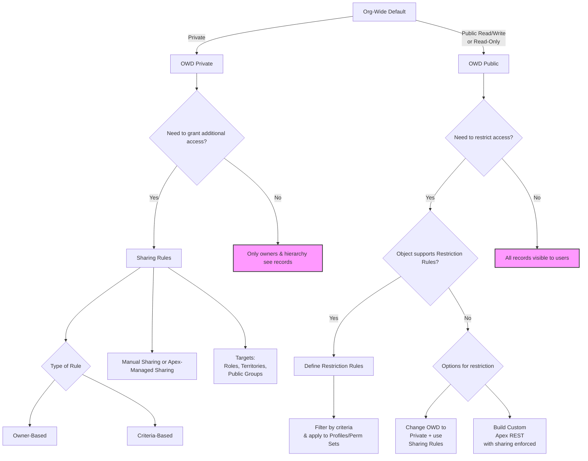

# access_rights

```mermaid

flowchart TD
    A[Org-Wide Default] 
      -->|Private| B[OWD Private]
    A 
      -->|Public Read/Write
or Read-Only| C[OWD Public]

    B --> D{Need to grant additional access?}
    D -->|Yes| E[Sharing Rules]
    D -->|No| S[Only owners & hierarchy see records]

    E --> F{Type of Rule}
    F --> G[Owner-Based]
    F --> H[Criteria-Based]
    E --> I[Manual Sharing or Apex-Managed Sharing]
    E --> J[Targets:
Roles, Territories,
Public Groups]

    C --> K{Need to restrict access?}
    K -->|Yes| L{Object supports Restriction Rules?}
    K -->|No| R[All records visible to users]

    L -->|Yes| M[Define Restriction Rules]
    M --> N[Filter by criteria
& apply to Profiles/Perm Sets]

    L -->|No| O{Options for restriction}
    O --> P[Change OWD to
Private + use
Sharing Rules]
    O --> Q[Build Custom\nApex REST
with sharing enforced]

    style S fill:#f9f,stroke:#333,stroke-width:2px
    style R fill:#f9f,stroke:#333,stroke-width:2px


```
