https://github.com/mshanemc/shane-sfdx-plugins

**sfdx shane:profile:convert -n <string> -p <string> [-d <directory>] [-e | -c] [--json] [--loglevel trace|debug|info|warn|error|fatal|TRACE|DEBUG|INFO|WARN|ERROR|FATAL]**

convert a profile into a permset

**USAGE**

  $ sfdx shane:profile:convert -n <string> -p <string> [-d <directory>] [-e | -c] [--json] [--loglevel
  trace|debug|info|warn|error|fatal|TRACE|DEBUG|INFO|WARN|ERROR|FATAL]

**OPTIONS**

  -c, --skinnyclone                                                                 create a new profile that's the
                                                                                    original profile less permset (does
                                                                                    not modify original profile)

  -d, --directory=directory                                                         [default: force-app/main/default]
                                                                                    Where is all this metadata? defaults
                                                                                    to force-app/main/default

  -e, --editprofile                                                                 remove metadata from original
                                                                                    profile

  -n, --name=name                                                                   (required) path to existing permset.
                                                                                    If it exists, new perms will be
                                                                                    added to it.  If not, then it'll be
                                                                                    created for you

  -p, --profile=profile                                                             (required) API name of an profile to
                                                                                    convert.  If blank, then you mean
                                                                                    ALL the objects and ALL their fields
                                                                                    and ALL their tabs

  --json                                                                            format output as json

  --loglevel=(trace|debug|info|warn|error|fatal|TRACE|DEBUG|INFO|WARN|ERROR|FATAL)  [default: warn] logging level for
                                                                                    this command invocation

**EXAMPLES**

  **sfdx shane:profile:convert -p Admin -n MyNewPermSet -e**
  
  // create a permset in force-app/main/default from the Admin profile (profiles/Admin).  If MyNewPermSet doesn't exist,
  it will be created.  Content is removed from Admin profile (-e)

   **sfdx shane:profile:convert -p Admin -n MyNewPermSet -c**
  
  // create a permset in force-app/main/default from the Admin profile (profiles/Admin).  If MyNewPermSet doesn't exist,
  it will be created.  Leaves the original Admin profile and creates an Admin_Skinny profile that has everything in the
  permset removed (-c)

```mermaid
flowchart TD
    A[🎯 Start Migration] --> B[📋 Audit and Planning]
    
    B --> B1[📊 Identify profiles to migrate]
    B --> B2[👥 List impacted users]
    B --> B3[📝 Document current permissions]
    
    B1 --> C{🔍 Working Environment}
    B2 --> C
    B3 --> C
    
    C -->|Sandbox| D[🏗️ Preparation Phase]
    C -->|Production| ERROR1[❌ Migrate in Sandbox first!]
    
    D --> E[🔧 Metadata Generation]
    E --> E1[☕ Execute MetadataRetriever3.java]
    E1 --> E2[📦 Generate package_main_key_metadata.xml]
    E2 --> E3[📥 sf project retrieve start]
    
    E3 --> F[✅ Profile Verification]
    F --> F1{🔍 Profiles complete?}
    F1 -->|No| F2[🔄 Retrieve missing metadata]
    F2 --> F1
    F1 -->|Yes| G[🔄 Conversion Phase]
    
    G --> G1[⚡ sf shane:profile:convert]
    G1 --> G2[📋 Verify generated files]
    G2 --> G3[🔍 Check emptied profile-meta.xml]
    G3 --> G4[✅ Validate created permissionset-meta.xml]
    
    G4 --> H[👤 Automatic Assignment]
    H --> H1[🔧 Execute Apex assignment script]
    H1 --> H2[📊 Verify created assignments]
    H2 --> H3[🧪 Test user access]
    
    H3 --> I{🚀 Deployment Method}
    
    I -->|Changeset| J[📋 Create changeset]
    I -->|Package| K[📦 Create package]
    I -->|DevOps| L[🔄 CI/CD Pipeline]
    
    J --> J1[➕ Add modified profile-meta.xml]
    J1 --> J2[➕ Add new permissionset-meta.xml]
    J2 --> J3[📤 Upload to Production]
    
    K --> K1[📦 Create destructive changes]
    K1 --> K2[📦 Package with new permission sets]
    K2 --> K3[🚀 sf project deploy start]
    
    L --> L1[🔄 Commit to Git repo]
    L1 --> L2[✅ Automated validation]
    L2 --> L3[🚀 Automated deployment]
    
    J3 --> M[🧪 Production Testing Phase]
    K3 --> M
    L3 --> M
    
    M --> M1[👥 Test with pilot users]
    M1 --> M2[🔍 Verify permissions]
    M2 --> M3[📊 Monitor errors]
    M3 --> M4{✅ Tests OK?}
    
    M4 -->|No| M5[🔧 Fix and retest]
    M5 --> M1
    M4 -->|Yes| N[📢 Communication and Training]
    
    N --> N1[📧 Inform users]
    N1 --> N2[📚 Train admins]
    N2 --> N3[📖 Update documentation]
    
    N3 --> O[🧹 Cleanup Phase]
    O --> O1{🤔 Delete old profiles?}
    O1 -->|Yes| O2[⚠️ Backup profiles]
    O2 --> O3[🗑️ Progressive deletion]
    O1 -->|No| O4[📋 Keep profiles as fallback]
    
    O3 --> P[✅ Migration Completed]
    O4 --> P
    
    P --> Q[📊 Metrics and Report]
    Q --> Q1[📈 Number of migrated users]
    Q1 --> Q2[⏱️ Migration time]
    Q2 --> Q3[🎯 Future improvements]
    
    %% Key Metadata Types Section
    KEYS[📦 KEY METADATA TYPES<br/>Retrieved and Deployed Together<br/><br/>🔹 Profile * - Critical profiles<br/>🔹 PermissionSet * - Permission sets<br/>🔹 CustomObject * - Custom objects<br/>🔹 ApexClass * - Apex classes<br/>🔹 ApexPage * - Visualforce pages<br/>🔹 CustomApplication * - Apps<br/>🔹 CustomTab * - Custom tabs<br/>🔹 Flow * - Flows and processes<br/>🔹 CustomPermission * - Custom permissions<br/>🔹 CustomMetadata * - Custom metadata<br/>🔹 ExternalDataSource * - External data<br/>🔹 CustomField - Field permissions<br/>🔹 RecordType - Record type access<br/><br/>* = Uses wildcard retrieval<br/>Others = Specific member listing]
    
    E2 -.->|Contains| KEYS
    KEYS -.->|Required for| G1
    
    %% Styles
    classDef startEnd fill:#e1f5fe,stroke:#01579b,stroke-width:3px
    classDef process fill:#f3e5f5,stroke:#4a148c,stroke-width:2px
    classDef decision fill:#fff3e0,stroke:#e65100,stroke-width:2px
    classDef error fill:#ffebee,stroke:#b71c1c,stroke-width:2px
    classDef success fill:#e8f5e8,stroke:#2e7d32,stroke-width:2px
    classDef metadata fill:#e3f2fd,stroke:#1565c0,stroke-width:2px
    
    class A,P startEnd
    class B1,B2,B3,E1,E2,E3,G1,G2,G3,G4,H1,H2,H3,J1,J2,J3,K1,K2,K3,L1,L2,L3,M1,M2,M3,N1,N2,N3,O2,O3,Q1,Q2,Q3 process
    class C,F1,I,M4,O1 decision
    class ERROR1,M5 error
    class G4,H3,P success
    class KEYS metadata
```

