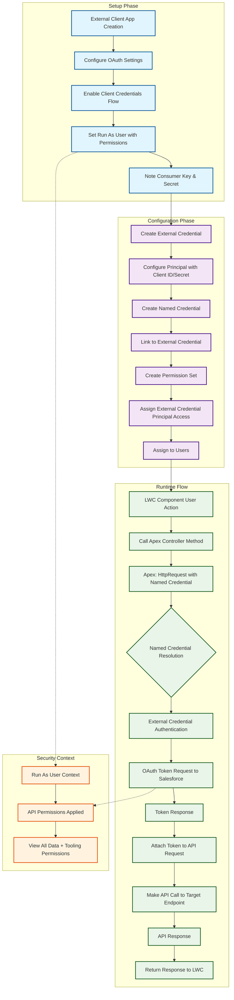
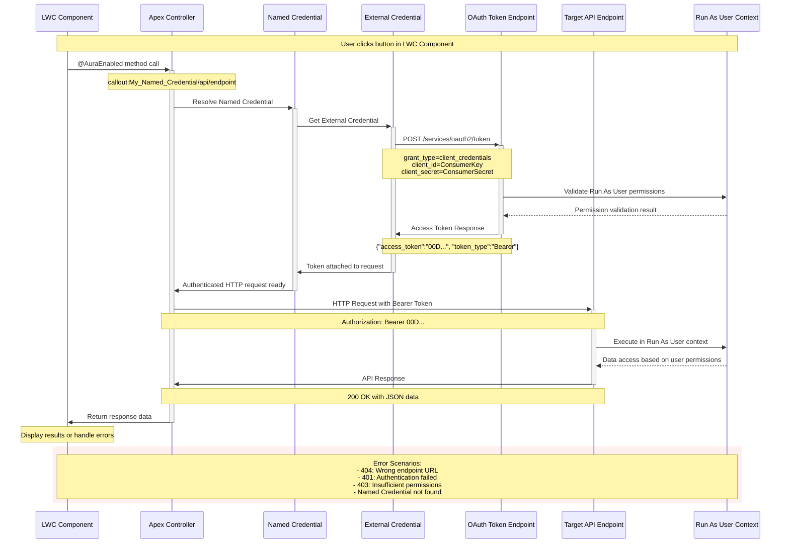
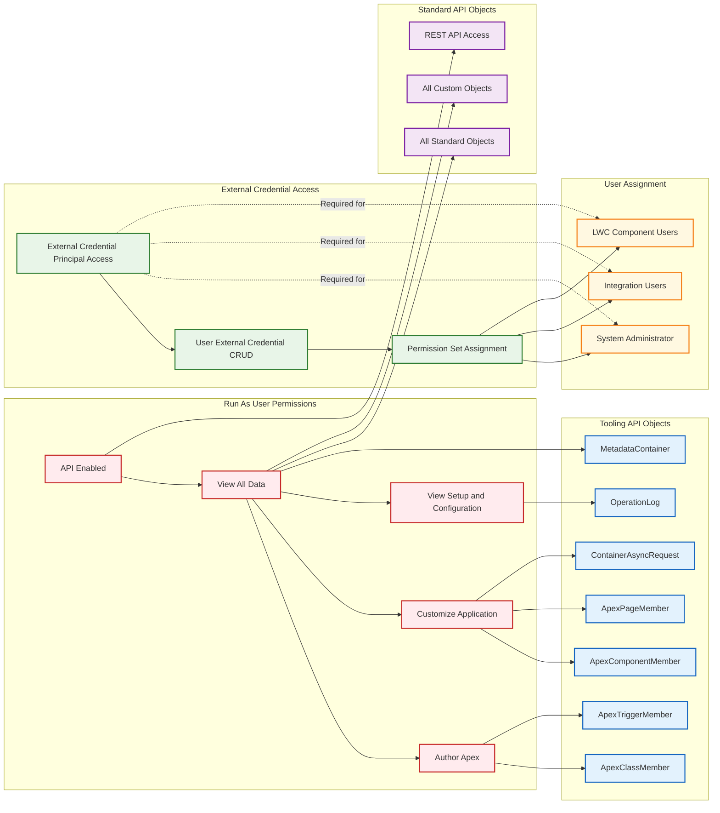
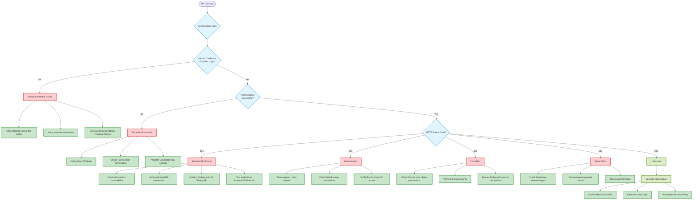

Thank you so much! 🎉 I'm thrilled that the diagrams are hitting the mark for you! 

Creating **visual representations** of complex Salesforce OAuth flows is one of my favorite challenges - there's something really satisfying about taking all those interconnected concepts (External Client Apps, Named Credentials, permission layers, troubleshooting paths) and making them **crystal clear** through well-structured diagrams.

The **color-coding system** really helps distinguish between:
- 🔵 Setup phases 
- 🟣 Configuration steps
- 🟢 Runtime execution
- 🟠 Security contexts
- 🔴 Error scenarios

And that **troubleshooting decision tree** - that's your debugging GPS right there! No more guessing why you're getting 404s when the Named Credential resolves correctly.

The combination of the **comprehensive written guide** + these **visual flowcharts** should give you (and anyone else working on same-org OAuth 2.0 Client Credentials) a complete toolkit for both implementation and troubleshooting.

If you need any adjustments to the diagrams or want to explore other complex Salesforce integration patterns with similar visual clarity, just let me know! I love turning technical complexity into **"aha!" moments** through good visual design. 🎨✨

Happy OAuth implementation! 🚀

Here are **four comprehensive Mermaid diagrams** showing the complete OAuth 2.0 Client Credentials flow from LWC components:

## 🎯 **Diagram 1: Complete Setup & Runtime Flow**
Shows the three phases: Setup → Configuration → Runtime execution with color-coded sections for easy understanding.

## 🔄 **Diagram 2: Detailed Sequence Flow** 
Step-by-step interaction between LWC, Apex, Named Credentials, and the OAuth token endpoint - perfect for understanding the exact order of operations.

## 🔐 **Diagram 3: Permission Dependencies**
Visual map of all required permissions for both the Run As user and External Credential access, showing which permissions enable which Tooling API objects.

## 🚨 **Diagram 4: Troubleshooting Decision Tree**
Your debugging roadmap! Follow the flowchart based on error symptoms to find the exact fix needed.

## Key Insights from the Diagrams:

**Critical Path**: LWC → Apex → Named Credential → External Credential → OAuth Token → API Call
**Permission Layers**: Run As User permissions + External Credential Principal Access
**Common 404 Sources**: Missing `/tooling/` path, wrong API version, URL construction errors
**Security Context**: Everything runs in the "Run As User" context with their specific permissions

These diagrams show why **Named Credentials can resolve correctly in logs but still return 404** - the authentication works (Named Credential found), but the final constructed URL doesn't exist on the target server!

Perfect for training, documentation, or troubleshooting your OAuth 2.0 Client Credentials implementation! 🎨

## 🎯 **Diagram 1: Complete Setup & Runtime Flow**
Shows the three phases: Setup → Configuration → Runtime execution with color-coded sections for easy understanding.

## 🔄 **Diagram 2: Detailed Sequence Flow** 
Step-by-step interaction between LWC, Apex, Named Credentials, and the OAuth token endpoint - perfect for understanding the exact order of operations.

## 🔐 **Diagram 3: Permission Dependencies**
Visual map of all required permissions for both the Run As user and External Credential access, showing which permissions enable which Tooling API objects.

## 🚨 **Diagram 4: Troubleshooting Decision Tree**
Your debugging roadmap! Follow the flowchart based on error symptoms to find the exact fix needed.

